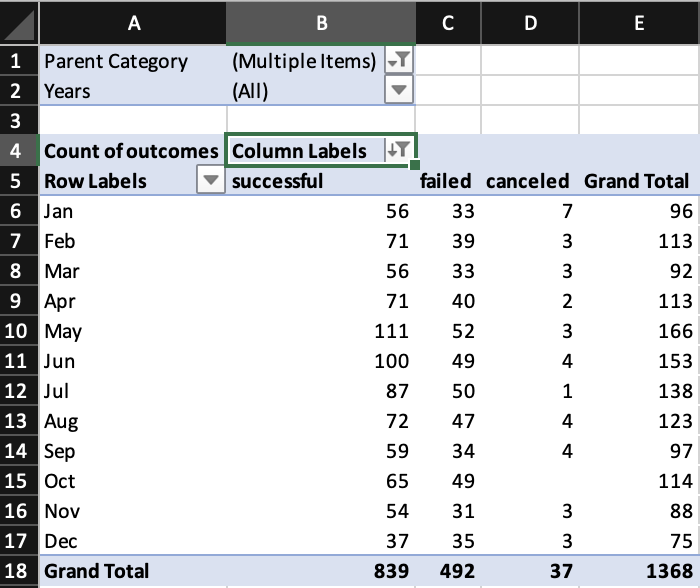
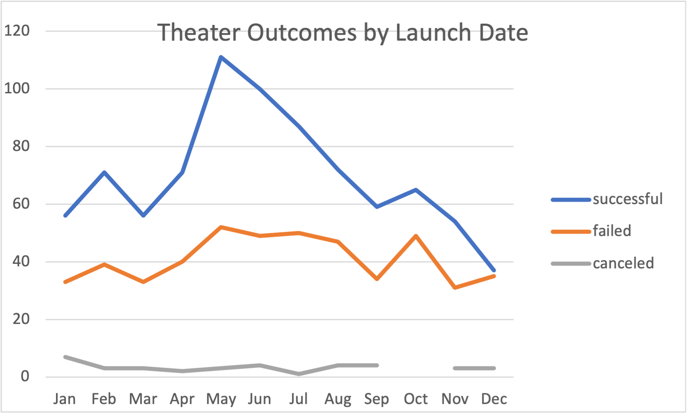
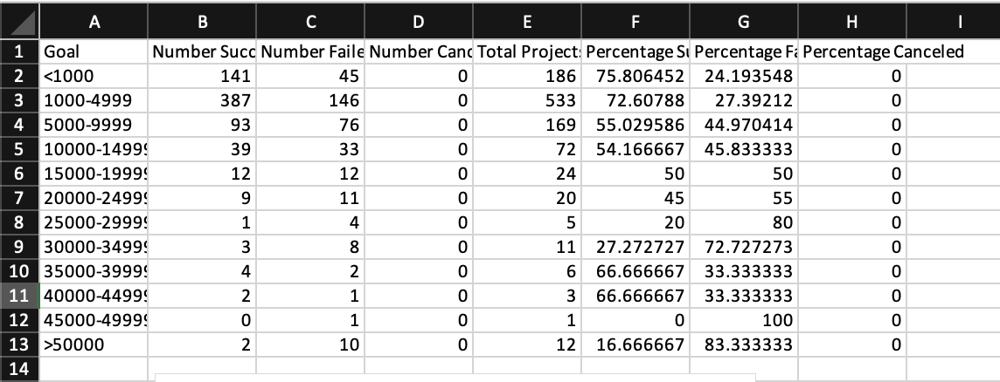
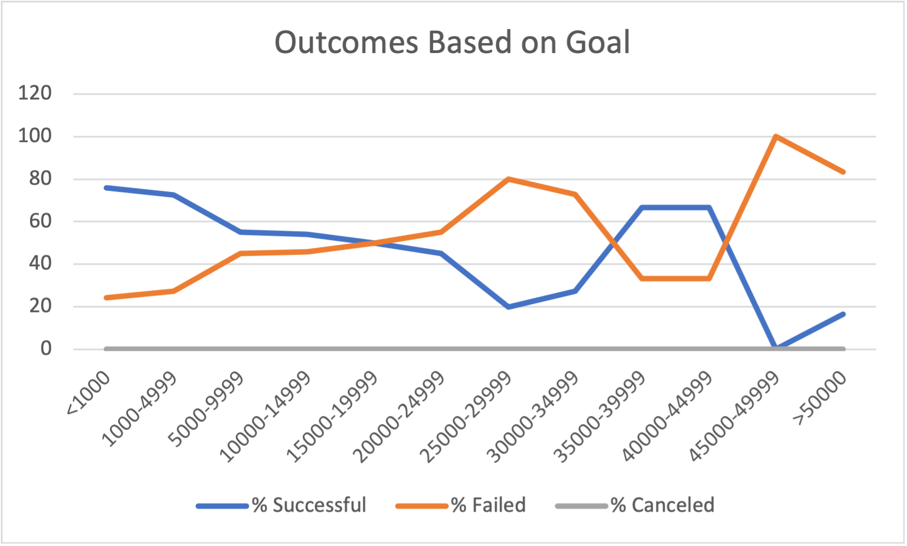

# An Analysis of Kickstarter Campaigns

# Overview

Louise wants to know how her campaign compared to the other thousands of campaigns on her spreadsheet. The purpose of this project was to investigate the outcomes of various kickstarter campaigns based on the month in which they were launched and the funding goals of each campaign. By filtering the data to only look at plays and then creating two line graphs based on the percentage of successful vs failed campaigns and the number of successful campaigns by month, we were able to get a much better picture of when is the best time to launch a campaign.

# Analysis of outcomes based on launch dates

To obtain this information, I first had to filter the campaigns by filtering for the parent category “theater/plays” and then the subcategory of “theater”. I then created another column that translated the unix timestamp to an actual date. With each row having an outcome and a date, the next step was to arrange all of this data into a pivot table and filter the columns by successful, failed, and canceled and the rows by each month. To better visualize this filtered data, I created a line chart with different colored lines for each outcome. With the data presented this way, it was easy to see that May was the month with the highest number of successful outcomes in the theater subcategory. I noticed that for the month of October, there was a gap in the data for the number of canceled projects. Thinking that I had done something wrong, I went back to the kickstarter tab and filtered for canceled projects in the month of October. Upon doing so, I found that there were none and when talking with other classmates, I found that they had gotten the same result.

 

# Analysis of outcomes based on goals

This step involved using the COUNTIF function to fetch data based on certain criteria, including the outcome, the goal amount range, and the subcategory. For column E, I used the addition formula to display the sum of the values of columns B, C, and D in that row. For columns F and G, it was just a matter of using a combination of division and multiplication to find the percentages. I had significant difficulty with applying the COUNTIF formula correctly and so often I did not know if the number that I had gotten from inputting a formula would be correct or not. To get around this problem, I had to coordinate with fellow classmates and try different ways of ordering the formula and the filters. Once I got it right, it was just a matter of changing the criteria based on each goal bracket. I noticed that I was getting 0 for all the cells in the canceled column. Thinking that I was doing something wrong to be getting the same result over and over again, I double and then triple-checked the formula. Afterwards, I applied the filters to the kickstarter sheet and found that there were no plays that were canceled. Sure of my results, I created a line graph to better visualize the data. Upon doing so, I found that although plays with higher funding goals tended to have higher rates of failure, the correlation was not very strong. 

 

# Outcomes by Launch Date Results 

Looking at the results of the theater outcomes by launch date, one can see that May is the month with the highest number of successful campaigns with June and July trailing behind. The months that saw the least amount of successful campaigns were the Winter months of November and December, followed closely by January. The number of failed and canceled campaigns stayed relatively constant throughout the year. Statistically speaking, it looks like plays are most likely to succeed if they are launched at the start of the summer. Knowing this, Louise should launch her campaign then for the highest chance of success. 

# Outcomes by Goals Results

The results based on the goals were only somewhat conclusive. It seemed like there was an inverse relationship between how high the goal was and the success rate. However, there were a couple of outliers and thus it was hard to determine if there was a solid relationship between these two factors. However, overall speaking, it seems like plays with high fundraising goals had higher rates of failure, but not by much. Based on the results, Louise should try to keep her fundraising goal average and not too high.

# Limitations of the dataset

Although the research produced some interesting results, limitations remain. For example, it is difficult to isolate whether a campaign failed or succeeded because it was the wrong time of year or because its fundraising goal was too high. Additionally, other factors such as the quantity of backers, the percentage funded, and the average donation are not factored into consideration. For this reason, we recommend that several graphs comparing the relationship between these factors and the success rate be made to gather more information.
